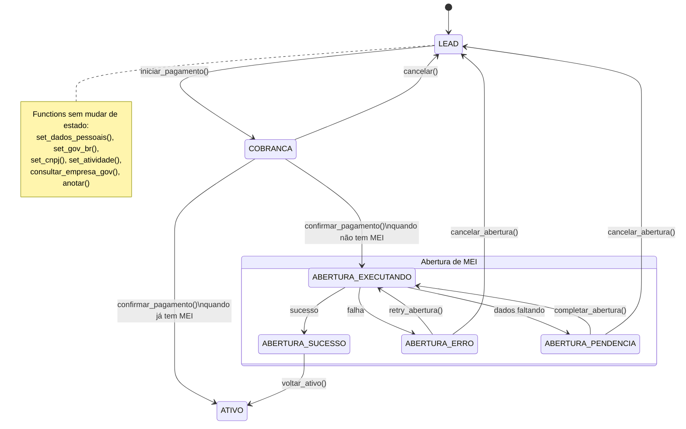
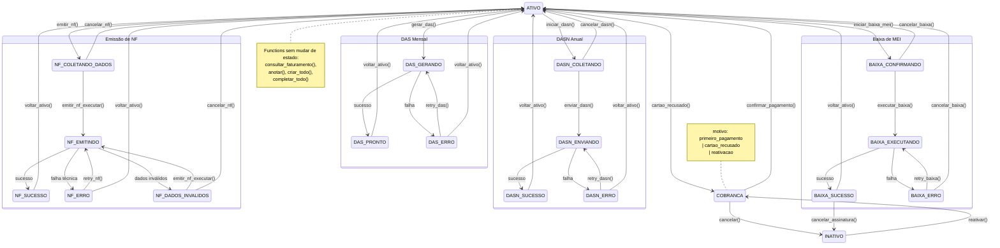
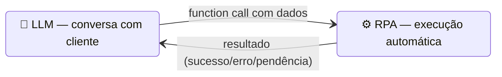

# Zain Gestão - Máquina de Estados de Atendimento

## Visão Geral

Cada cliente tem **um estado atual**, **propriedades estruturadas** do estado, e uma **memória persistente**. O LLM recebe o prompt correspondente ao estado + propriedades + memória, e pode:

1. **Chamar functions sem mudar de estado** — para preencher propriedades, consultar dados, anotar informações
2. **Transicionar de estado** — via function calls específicas que mudam o estado atual

Alguns estados são **LLM** (conversa com o cliente), outros são **RPA** (execução automática nos portais do governo). Estados RPA resolvem para um estado LLM (sucesso, falha, ou necessidade de mais info).

---

## Memória do Cliente

```
memória = {
  // Dados estruturados
  dados_pessoais: { nome, cpf, telefone, email },
  gov_br: { usuario, senha, nivel },        // credenciais gov.br
  empresa: { cnpj, razao_social, nome_fantasia, cnae, situacao, data_abertura },
  assinatura: { status, data_inicio, metodo_pagamento },
  faturamento: { acumulado_ano, limite, mes_a_mes: [...] },
  das: { ultimo_pago, proxima_guia, em_atraso: [...] },
  nfs_emitidas: [ { data, valor, tomador, numero } ],
  dasn: { ultima_entrega, ano_referencia },

  // Dados não estruturados (escritos pelo LLM)
  anotacoes: string,          // observações livres do LLM sobre o cliente
  todos: [ { descricao, prioridade, prazo } ],  // atividades pendentes
  contexto_conversa: string,  // resumo do que estava sendo tratado
}
```

---

## Estados

### Diagrama: Onboarding (Lead → Cliente)



### Diagrama: Cliente Ativo



### Legenda



---

## Detalhamento dos Estados

### 1. LEAD
- **Tipo:** LLM
- **Prompt:** Você é a Zain Gestão. Acolha a pessoa, tire dúvidas sobre o serviço, entenda a situação dela. Colete informações progressivamente usando as functions disponíveis. Quando tiver tudo, direcione para abertura (se não tem MEI) ou pagamento (se já tem).
- **Propriedades do estado:**
  ```
  lead = {
    tem_mei: bool | null,
    nome: string | null,
    cpf: string | null,
    cnpj: string | null,
    atividade_descricao: string | null,  // o que a pessoa faz
    cnae: string | null,
    endereco: string | null,
    gov_br_usuario: string | null,
    gov_br_senha: string | null,
    dados_empresa_gov: object | null,    // retorno da consulta Gov.br
  }
  ```
- **Functions sem mudar de estado:**
  - `set_dados_pessoais(nome, cpf)` — preenche nome e CPF
  - `set_tem_mei(tem_mei: bool)` — marca se já tem MEI
  - `set_cnpj(cnpj)` — preenche CNPJ
  - `set_atividade(descricao, cnae?)` — preenche atividade/CNAE
  - `set_endereco(endereco)` — preenche endereço
  - `set_gov_br(usuario, senha)` — preenche credenciais Gov.br
  - `consultar_empresa_gov()` → faz RPA de consulta no Gov.br, retorna dados da empresa e preenche `dados_empresa_gov` (requer `cnpj` + `gov_br_*` preenchidos)
  - `anotar(texto)` — salva anotação livre na memória
- **Transições:**
  - `iniciar_pagamento()` → COBRANCA (sempre passa por cobrança primeiro, antes de qualquer execução)

---

### 2. COBRANCA
- **Tipo:** LLM
- **Prompt:** Adaptado conforme `motivo`. Objetivo: obter cartão de crédito válido.
- **Nota:** O primeiro mês é grátis. Mas é obrigatório cadastrar um cartão de crédito válido para iniciar. A cobrança de R$ 19,90 começa no segundo mês.
- **Propriedades do estado:**
  ```
  cobranca = {
    motivo: "primeiro_pagamento" | "cartao_recusado" | "reativacao",
    tem_mei: bool,                    // determina se após pagamento vai para ATIVO ou ABERTURA
    tentativas: number,
    ultimo_erro: string | null,       // ex: "cartão expirado", "saldo insuficiente"
  }
  ```
- **Comportamento por motivo:**
  | Motivo | Tom do prompt | Destino se confirmar | Destino se cancelar |
  |---|---|---|---|
  | `primeiro_pagamento` | Acolhedor, primeiro mês grátis, só precisa do cartão | ATIVO (tem MEI) ou ABERTURA_EXECUTANDO (não tem) | LEAD |
  | `cartao_recusado` | Gentil mas direto, informar que o cartão falhou | ATIVO | INATIVO (após grace period) |
  | `reativacao` | Bem-vindo de volta, relembrar benefícios, primeiro mês grátis na volta | ATIVO | INATIVO |
- **Functions sem mudar de estado:**
  - `enviar_link_pagamento()` — gera e envia link para cadastro de cartão
  - `registrar_tentativa(erro?)` — incrementa tentativas, salva erro
- **Transições:**
  - `confirmar_pagamento(id_assinatura)` → ATIVO (se `tem_mei`) ou ABERTURA_EXECUTANDO (se `!tem_mei`)
  - `cancelar()` → LEAD (se primeiro_pagamento) ou INATIVO (demais)

---

### 3. ATIVO
- **Tipo:** LLM
- **Prompt:** Cliente ativo da Zain Gestão. Responda dúvidas contábeis/fiscais, execute serviços sob demanda. Você tem acesso à memória completa do cliente.
- **Functions sem mudar de estado:**
  - `consultar_faturamento()` — retorna acumulado do ano vs. teto
  - `anotar(texto)` — salva anotação na memória
  - `criar_todo(descricao, prazo)` — adiciona pendência
  - `completar_todo(id)` — marca pendência como concluída
- **Transições:**
  - `emitir_nf()` → NF_COLETANDO_DADOS
  - `gerar_das()` → DAS_GERANDO
  - `iniciar_dasn()` → DASN_COLETANDO
  - `iniciar_baixa_mei()` → BAIXA_CONFIRMANDO

---

## Fluxo: Emissão de NF

### 4. NF_COLETANDO_DADOS
- **Tipo:** LLM
- **Prompt:** O cliente quer emitir uma nota fiscal. Colete: valor, descrição do serviço, dados do tomador (CNPJ/CPF, nome, endereço). Confirme tudo antes de emitir.
- **Propriedades do estado:**
  ```
  nf = {
    valor: number | null,
    descricao: string | null,
    tomador_doc: string | null,    // CPF ou CNPJ
    tomador_nome: string | null,
    tomador_endereco: string | null,
  }
  ```
- **Functions sem mudar de estado:**
  - `set_nf_dados(valor?, descricao?, tomador_doc?, tomador_nome?, tomador_endereco?)` — preenche dados da NF progressivamente
- **Transições:**
  - `emitir_nf_executar()` → NF_EMITINDO (requer todos os campos preenchidos)
  - `cancelar_nf()` → ATIVO

### 5. NF_EMITINDO
- **Tipo:** RPA
- **Ação:** Acessa Portal NFS-e Nacional com credenciais Gov.br, preenche e emite a nota.
- **Transições automáticas:**
  - Sucesso → NF_SUCESSO
  - Falha técnica → NF_ERRO
  - Dados inválidos → NF_DADOS_INVALIDOS

### 6. NF_SUCESSO
- **Tipo:** LLM
- **Prompt:** NF emitida com sucesso. Informe o número, envie o PDF, atualize a memória (faturamento acumulado). Pergunte se precisa de mais alguma coisa.
- **Transições:**
  - `voltar_ativo()` → ATIVO

### 7. NF_ERRO
- **Tipo:** LLM
- **Prompt:** Houve um erro técnico ao emitir a NF. Informe o cliente, explique que vamos tentar novamente. [Detalhes do erro disponíveis na memória].
- **Transições:**
  - `retry_nf()` → NF_EMITINDO
  - `voltar_ativo()` → ATIVO

### 8. NF_DADOS_INVALIDOS
- **Tipo:** LLM
- **Prompt:** O portal rejeitou os dados da NF. [Motivo do erro]. Peça correção ao cliente.
- **Functions sem mudar de estado:**
  - `set_nf_dados(...)` — corrige os dados
- **Transições:**
  - `emitir_nf_executar()` → NF_EMITINDO
  - `cancelar_nf()` → ATIVO

---

## Fluxo: DAS Mensal

### 9. DAS_GERANDO
- **Tipo:** RPA
- **Ação:** Acessa PGMEI, gera guia DAS do mês corrente.
- **Transições automáticas:**
  - Sucesso → DAS_PRONTO
  - Falha → DAS_ERRO

### 10. DAS_PRONTO
- **Tipo:** LLM
- **Prompt:** Guia DAS gerada. Envie o PDF/código de barras, informe valor e vencimento.
- **Transições:**
  - `voltar_ativo()` → ATIVO

### 11. DAS_ERRO
- **Tipo:** LLM
- **Prompt:** Não foi possível gerar o DAS. [Motivo]. Oriente o cliente.
- **Transições:**
  - `retry_das()` → DAS_GERANDO
  - `voltar_ativo()` → ATIVO

---

## Fluxo: DASN-SIMEI (Declaração Anual)

### 12. DASN_COLETANDO
- **Tipo:** LLM
- **Prompt:** Hora de fazer a declaração anual. Confirme o faturamento total do ano com o cliente. Cruze com os dados que temos na memória.
- **Propriedades do estado:**
  ```
  dasn = {
    faturamento_total: number | null,
    teve_empregado: bool | null,
  }
  ```
- **Functions sem mudar de estado:**
  - `set_dasn_dados(faturamento_total?, teve_empregado?)` — preenche dados
- **Transições:**
  - `enviar_dasn()` → DASN_ENVIANDO (requer campos preenchidos)
  - `cancelar_dasn()` → ATIVO

### 13. DASN_ENVIANDO
- **Tipo:** RPA
- **Ação:** Acessa portal do Simples Nacional, preenche e transmite DASN-SIMEI.
- **Transições automáticas:**
  - Sucesso → DASN_SUCESSO
  - Falha → DASN_ERRO

### 14. DASN_SUCESSO
- **Tipo:** LLM
- **Prompt:** DASN enviada com sucesso. Envie o recibo. Atualize memória.
- **Transições:**
  - `voltar_ativo()` → ATIVO

### 15. DASN_ERRO
- **Tipo:** LLM
- **Prompt:** Erro ao enviar DASN. [Motivo]. Oriente o cliente.
- **Transições:**
  - `retry_dasn()` → DASN_ENVIANDO
  - `voltar_ativo()` → ATIVO

---

## Fluxo: Abertura de MEI

### 16. ABERTURA_EXECUTANDO
- **Tipo:** RPA
- **Ação:** Acessa Gov.br → Portal do Empreendedor → formalização do MEI.
- **Transições automáticas:**
  - Sucesso → ABERTURA_SUCESSO
  - Falha → ABERTURA_ERRO
  - Pendência (dados faltando) → ABERTURA_PENDENCIA

### 17. ABERTURA_SUCESSO
- **Tipo:** LLM
- **Prompt:** MEI aberto com sucesso! Informe CNPJ, envie CCMEI. Cliente já pagou, está pronto para operar.
- **Transições:**
  - `voltar_ativo()` → ATIVO

### 18. ABERTURA_ERRO
- **Tipo:** LLM
- **Prompt:** Erro na abertura. [Motivo: impedimento cadastral, CPF irregular, etc.]. Oriente o cliente.
- **Transições:**
  - `retry_abertura()` → ABERTURA_EXECUTANDO
  - `cancelar_abertura()` → LEAD

### 19. ABERTURA_PENDENCIA
- **Tipo:** LLM
- **Prompt:** O portal precisa de informações adicionais: [detalhes]. Peça ao cliente.
- **Transições:**
  - `completar_abertura(dados_adicionais)` → ABERTURA_EXECUTANDO
  - `cancelar_abertura()` → LEAD

---

## Fluxo: Baixa de MEI

### 20. BAIXA_CONFIRMANDO
- **Tipo:** LLM
- **Prompt:** O cliente quer encerrar o MEI. Isso é irreversível. Confirme a intenção, informe consequências (pendências fiscais, DASN de extinção). Verifique se há DAS em atraso.
- **Transições:**
  - `executar_baixa()` → BAIXA_EXECUTANDO
  - `cancelar_baixa()` → ATIVO

### 21. BAIXA_EXECUTANDO
- **Tipo:** RPA
- **Ação:** Acessa Portal do Empreendedor → solicita baixa do MEI.
- **Transições automáticas:**
  - Sucesso → BAIXA_SUCESSO
  - Falha → BAIXA_ERRO

### 22. BAIXA_SUCESSO
- **Tipo:** LLM
- **Prompt:** MEI encerrado. Informe que ainda precisa entregar DASN de extinção. Pergunte se quer cancelar a assinatura.
- **Transições:**
  - `cancelar_assinatura()` → INATIVO
  - `voltar_ativo()` → ATIVO (caso queira manter para DASN de extinção)

### 23. BAIXA_ERRO
- **Tipo:** LLM
- **Prompt:** Erro ao dar baixa no MEI. [Motivo: débitos pendentes, etc.]. Oriente.
- **Transições:**
  - `retry_baixa()` → BAIXA_EXECUTANDO
  - `cancelar_baixa()` → ATIVO

---

## Triggers Proativos (Lembretes)

Não são estados — são **gatilhos agendados** que enviam mensagem proativa. O estado continua sendo ATIVO.

| Trigger | Quando | Ação |
|---|---|---|
| `LEMBRETE_DAS` | 5 dias antes do vencimento (dia 15 de cada mês) | Envia mensagem com guia DAS, valor, código de barras |
| `LEMBRETE_DASN` | Março de cada ano | Avisa que prazo da DASN é 31 de maio |
| `ALERTA_TETO` | Quando faturamento acumulado > 80% do limite | Alerta sobre proximidade do teto de R$ 81k |
| `LEMBRETE_PAGAMENTO` | DAS vencido sem confirmação de pagamento | Cobra status do pagamento |

---

## Estado: INATIVO

### 24. INATIVO
- **Tipo:** LLM
- **Prompt:** Cliente cancelou a assinatura. Se mandar mensagem, explique os serviços e ofereça reativação.
- **Transições:**
  - `reativar()` → COBRANCA

---

## Resumo de Estados

| # | Estado | Tipo | Descrição |
|---|---|---|---|
| 1 | LEAD | LLM | Primeiro contato, qualificação, coleta progressiva de dados |
| 2 | COBRANCA | LLM | Cadastro de cartão / cobrança recusada / reativação |
| 3 | ATIVO | LLM | Cliente ativo, estado principal |
| 4-8 | NF_* | LLM/RPA | Fluxo de emissão de nota fiscal |
| 9-11 | DAS_* | LLM/RPA | Fluxo de geração de DAS |
| 12-15 | DASN_* | LLM/RPA | Fluxo de declaração anual |
| 16-19 | ABERTURA_* | LLM/RPA | Fluxo de abertura de MEI |
| 20-23 | BAIXA_* | LLM/RPA | Fluxo de baixa de MEI |
| 24 | INATIVO | LLM | Cliente cancelou |
